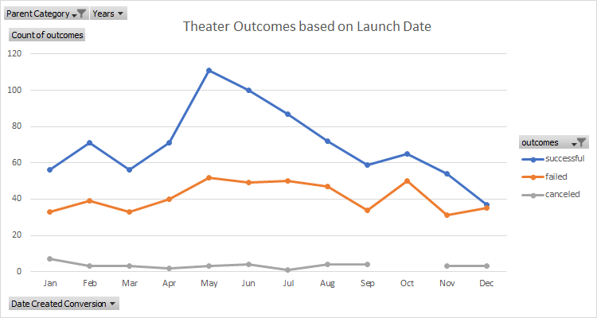

# Kickstarting with Excel

## Overview of Project

### Purpose

The purpose of this analysis is to determine the optimal conditions for executing a successful Kickstarter campaign in order to secure funding for a theatrical play committed to the US theater market. The need for this analsyis was prompted by the playwright Louise and her desire to fund a production of her play Fever with a budget of approximately $10,000.

## Analysis and Challenges

The main filed used for analysis can be found here: [Main Analysis File](Kickstarter_Analysis.xlsx)

### Analysis of Outcomes Based on Launch Date

The chart above suggests that Kickstarters for theater projects tend to be the most successful when they launch in the month of May.  After the month of May, the proportion of the population that is successful drops continuously until the end of the year in December where the ratio of successful to unsuccessful theater project Kicstarters approaches approximately one to one (a 50% success rate). Interestingly, the data indicate that theater projects started in any month will, on average, be more successful than unsuccessful.

### Analysis of Outcomes Based on Goals

The data suggest that theater projects with smaller goals have experienced the highest record of success. Specifically, projects with goals under $15,000 have experienced a greater than 50% success rate. While the data indicate success rates of 66.7% for goals ranging from $35,000 to $45,000, the sample sizes associated are very small and may not be a representative sample of all theater play projects with those funding goals. The sample sizes associated with projects with goals under $15,000 have large sample sizes that give confidence that the data are representative of what can be expected when a funding goal is set to be less than $15,000.

### Challenges and Difficulties Encountered

As is always a challenge with managing data and analysis in Excel, keeping track of which column identifiers on a sheet contain which data can lead to occasional missteps that required correcting.

## Results

Based on the analysis, the month of May has the best ratio of successful projects versus failed projects, indicating that it is the best month to start a Kickstarter campaign for a theater project. In contrast, December is the worst month to start a kickstarter campaign for a theater project, since the ratio of successul projects versus failed projects shrinks to indicate that about 50% of projects fail when started in December.

Based on the analysis, fundraising goals for plays in Kickstarter should aim to remain under $15,000 in order to maintain the highest probability of success. Funding the $10,000 budget for Fever should have approximately a 55% chance of success.

The dataset has some limitations in that the bulk of the theater project data available for this analysis is only from the years 2014, 2015, and 2016, since the number of theater play projects prior to those years was relatively small. While the dataset has the potential to be representative of overall trends, it is difficult to establish confidence that it is. Furthermore, the fact that the data do not include the last 5 years may indicate that it is not representative of current factors that may influence Kickstarter funding project success rates.  Also, as mentioned previously, the determination of outcomes based on goals has potentially misleading data since the 66.7% success rate for projects ranging from $35,000 to $45,000 were based on very small sample sizes.

A graph that would add further insight into this analysis would be to chart the changing rates of success and failure of theater play funding campaigns over time to see if there are any other trends to give indicators of what can play a role in executing a successful campgain or provide indicators of which pitfalls to avoid. Furthermore, narrowing the analysis to remove the earlier years where there were very few theater play projects that were all successfully funded may provide more refined insight into how the starting month of the campaign can impact the success rate.  Additionally, since there was mention in the problem statement that Louise had committed to the US theater market, it might be worthwhile to parse the data out by region to see if there is any regional dependence on success rates.